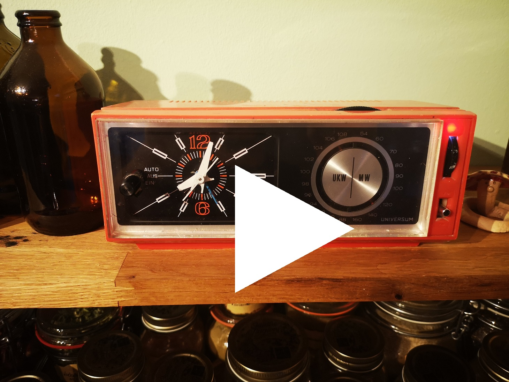
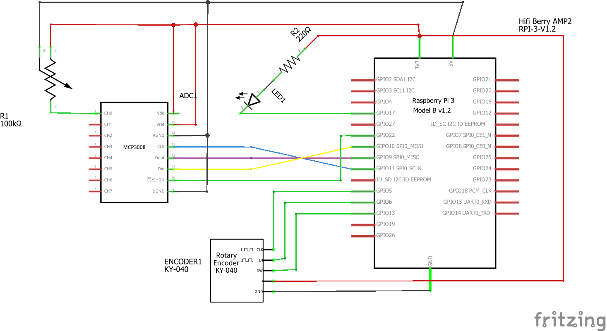
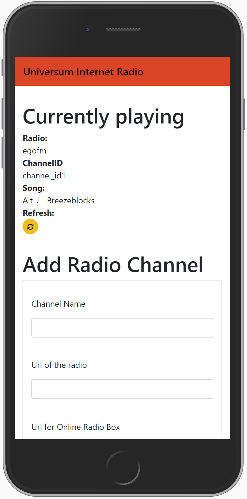

# Raspberry Internet Radio

My wife found an old Universum radio at a flee market. It did not really make a great
impression anymore, so I decided to make it an Internet Radio.
To do this I used a [Raspberry Pi Model 4](https://www.raspberrypi.org/products/raspberry-pi-4-model-b/)
and a [HifiBerry AMP2](https://www.hifiberry.com/shop/boards/hifiberry-amp2/). Additionally
I needed an MCP3008 and a KY040 to control the radio. See yourself how this
radio behaves like an old radio, including noise. But it can be controled via 
a pretty nice webapp.

**Python Packages**

- `flask` - for the webapp
- `flask_fontawesome` - to make the webapp awesome
- `wtforms` - to enable nice bootstrap forms
- `adafruit_mcp3xxx` - to control the MCP3008
- `RPi.GPIO` - to control the KYO40
- `threading` - to allow multiple channels controlling I/O
- `pylast` - to scrobble songs to last.fm

## Radio in Action

Please see the video below to see the radio in action:

[Watch radio in action](./fritzing/radio_in_action.mp4)

## Inside

This is the building plan of the radio

## App

A screenshot of the Flask App

